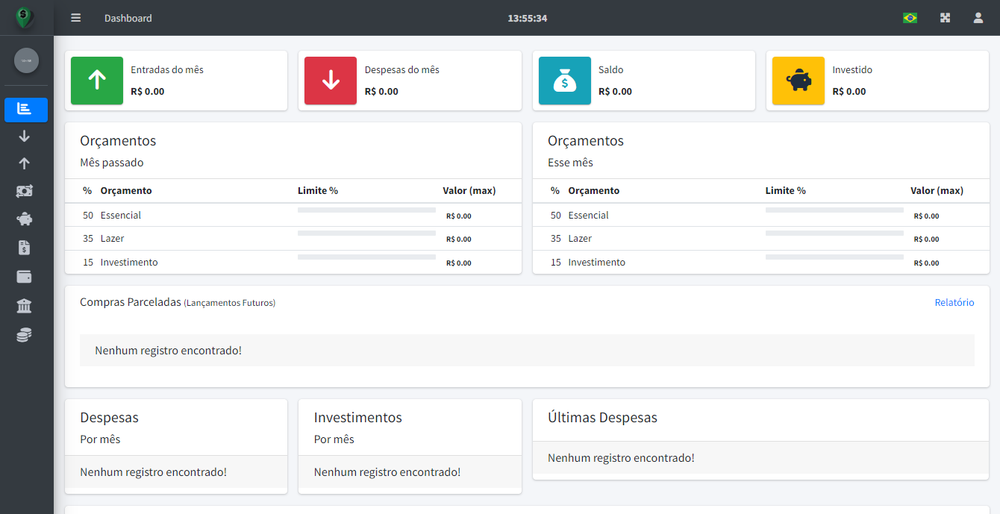
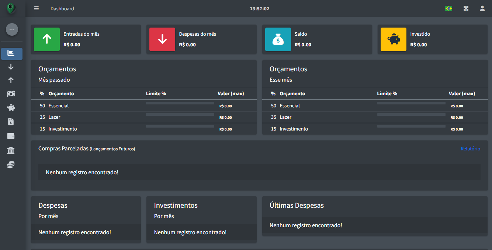

Desenvolvido em Laravel para controle de depesesas pessoais, usando como padrão o orçamento "50/35/15", sendo:

#### - 50% da receita, será destinado para despesas "Essenciais".
- Aluguel;
- Água;
- Energia;
- Internet;
- Educação;

#### - 35% da receita, será destinado para despesas de "Lazer".
- Serviços de Streaming;
- Diversão;
    
#### - 15% da receita, será destinado para Investimentos.

***
### Funções/Módulos
***
#### Despesas
- Todas as despesas são registradas tendo como informação o Banco/Conta utilizado, a forma de pagamento e o orçamento ao qual essa despesa pertence;
#### Entradas
- Todas as fontes de renda devem ser informadas para que sejam criados os orçamentos e indicadores na dashboard;

#### Transferências
- Caso seja necessário realizar alguma transferência entre contas de uma mesma pessoa, ou entre pessoas que seguem o mesmo orçamento. A mesma deverá ser inserida neste módulo, pois assim é possível acompanhar o saldo de cada conta bancária;

#### Investimentos
- Registro de investimentos realizados, sendo possível inserir no período que preferir o rendimento de cada um;

#### Faturas
- Caso haja utilização de Cartão de Crédito, será possível acompanhar os gastos por meio de uma "fatura pessoal";

#### Carteiras
- As carteiras tem como objetivo agrupar Cartões/Bancos/Dinheiro fisico de forma que possa ser compartilhado, ou não, com uma segunda pessoa que utilize o mesmo orçamento;

#### Bancos e Contas
- Todas as suas contas serão cadastradas aqui para informar despesas, investimento e etc.

#### Orçamento
- Caso deseje alterar o orçamento padrão do sistema;

***
### Screenshots
***

<p align="center">
  
  
</p>

***
### Web server Setup
***
1. Install Apache   
    `$ sudo apt update`   
    `$ sudo apt install apache2`
   
2. Install MySQL Server   
    `$ sudo apt install mysql-server`
   
3. Install PHP     
    `$ sudo apt install php8.0 libapache2-mod-php8.0 php-mysql8.0`

***
### Project/Database Setup
***
1. Run `git clone https://github.com/gelbcke/moneymap.git`
2. Create a MySQL database for the project
    * ```mysql -u root -p```   
    * ```create database money_map;```
      
3. Create user and give privileges
    * ```CREATE USER 'money_map'@'localhost' IDENTIFIED BY 'your_password_here';```
    * ```GRANT ALL PRIVILEGES ON money_map.* TO 'money_map'@'localhost';```  
    * ```quit;```

***
### Final Setup
***
1. Go to folder project
   * `cd /var/www/html/moneymap`
2. From the projects root run
   * `sudo cp .env.example .env`
3. Configure your `.env` file
4. From the projects root folder run
   * `composer install`
   * `php artisan key:generate`
   * `php artisan migrate`
   * `php artisan db:seed`
   * `php artisan optimize`  
   * `composer dump-autoload`
   
#### Set Folders and Files Permissions
   * ```sudo chmod -R 777 ./```   
   * ```sudo chown -R www-data:www-data ./```   
   * ```sudo find ./ -type f -exec chmod 644 {} \;```   
   * ```sudo find ./ -type d -exec chmod 755 {} \;```
   * ```sudo chgrp -R www-data storage bootstrap/cache```
   * ```sudo chmod -R ug+rwx storage bootstrap/cache```   
   * ```sudo chmod -R 777 ./bootstrap/cache/```

#### Credentials from SEED
- User: admin@moneymap.com
- Password: secret

Example `.env` file:
```
APP_NAME="Money MAP"
APP_ENV=local
APP_DEBUG=true
APP_KEY=SomeRandomString

DB_HOST=localhost
DB_DATABASE=money_map
DB_USERNAME=money_map
DB_PASSWORD=your_password

CACHE_DRIVER=file
SESSION_DRIVER=file
QUEUE_DRIVER=sync

MAIL_DRIVER=smtp
MAIL_HOST=mailtrap.io
MAIL_PORT=2525
MAIL_USERNAME=null
MAIL_PASSWORD=null
MAIL_ENCRYPTION=null
```

#### CRON Tasks
```
* * * * * php /var/www/html/moneymap/artisan schedule:run
```
